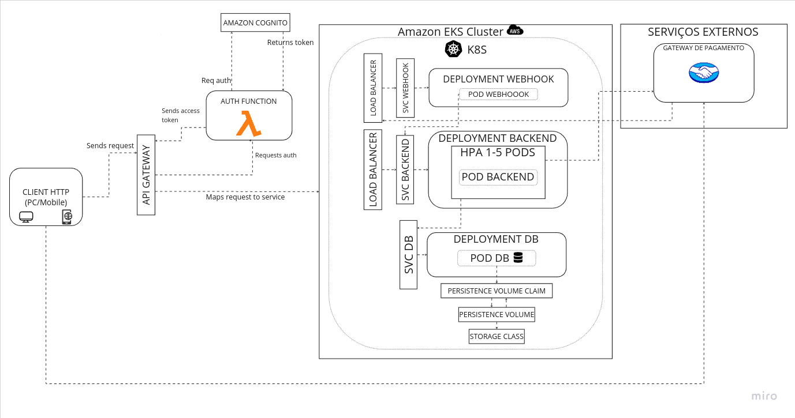

# Pós Tech - Tech challenge 2

### Alunos

- Débora Silveira - RM353919
- Eduardo Petri - RM353438
- Fernanda Serra - RM353224

### O que é o projeto?

Implementação da solução para a especificações do tech challenge #3 disponibilizada pela FIAP para o curso de pós graduação em Arquitetura de Software. Esse repositório contém a implementação completa do challenge, como solicitado foram criados repositórios separados para infraestrutura do k8s, banco, função serverless lambda e API em si. Esse repositório também contém a implementação do webhook de pagamento especificado na descrição do tech challenge #2.

A solução da camada de código foi desenvolvida em Typescript utilizando o framework Nestjs, o banco de dados utilza o ORM Prisma e os testes unitários foram implementados com o framework Jest. Nossa solução em nuvem foi desenvolvida utilizando a stack da Amazon Web Services (AWS), utilizando o serviço EKS para gerenciamento dos containers do ecosistema, API gateway para mapeamento dos serviços, RDS para gerenciamento do banco de dados relacional da nossa aplicação, Cognito como serviço de autenticação e Lambda serverless function para seu disparo.

### Documentação do sistema

[Miro]( https://miro.com/app/board/uXjVKUrPAdA=/?share_link_id=25578601860) contém:
- Event storming;
- MER;
- Desenho da arquitetura;

A arquitetura implementada está disposta na imagem abaixo:



#### Serviços:

- **Webhook**: serviço destinado a receber notificações, enviadas pela API do mercado pago, sobre andamento/status do pagamento referente a compra realizada no back-end;
- **Back-end**: serviço destinado ao gerenciamento de pedidos da lanchonete, é a interface com o banco de dados;
- **DB**: Banco de dados do back-end.

#### Infraestrutura:

Nossa aplicação é implantada utilizando Kubernetes. Criou-se um cluster com um único namespace (**snack-bar**), cada serviço descrito anteriormente dispõe de um pod. Além disso, para assegurar que o banco de dados está com a versão correta do seu schema, foi criado um job para a geração das migrations necessárias. 

O processo de autenticação é feito com os serviços cognito e Lambda function da AWS. Ao receber uma requisição de autenticação, o API Gateway irá direcioná-lo para a função serverless da lambda (**auth-func**). 

A lambda function por sua vez deve solicitar do Cognito um access token criado para os campos de login enviados, no nosso caso será apenas o cpf. O Access token dispõe de um contexto, o qual limita acesso às APIs dispostas na infraestrutura.

Da forma como implementamos o banco de dados inicialmente, não foi necessário realizar nenhuma mudança em seu esquema pois ele já está performático e otimizado, isso foi feito através da normalização do banco e estruturação das suas tabelas. A única implementação feita em cima disso, foi a conexão com a RDS e sua configuração através da infraestrutura do kubernetes.


### Requisitos 

- [Kubernetes](https://kubernetes.io/releases/download/);
- [Docker](https://docs.docker.com/get-docker/);
- [Git](https://git-scm.com/downloads);
- [AWS CLI](https://aws.amazon.com/cli/);
- [Terraform](https://developer.hashicorp.com/terraform/install).

### Como iniciar localmente

```bash
$ git submodule update --init --recursive
$ cd snack-bar-api-infra-k8s/k8s/
$ kubectl apply -f .
```

Para validar o funcionamento da API, utilize a collection do [postman](https://drive.google.com/file/d/1QbAelxs9t26lzl5J3oAwloiguJduVlrh/view?usp=sharing)

## Como rodar os testes localmente

```bash
$ cd snack-bar-api
$ npm i
$ npm run test
```
